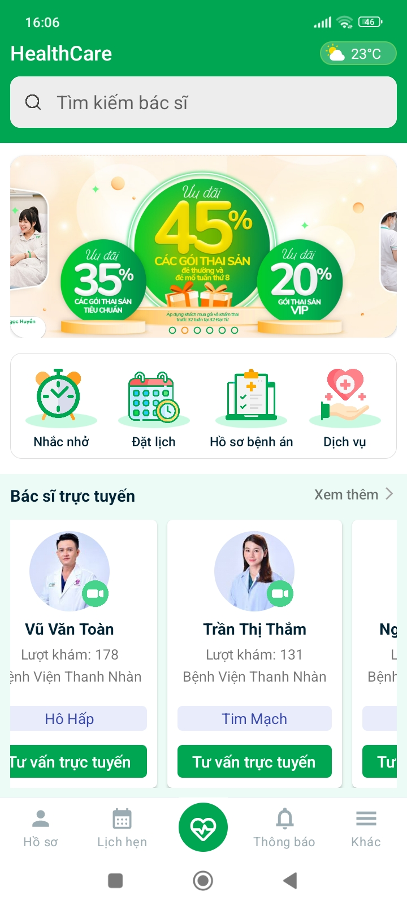
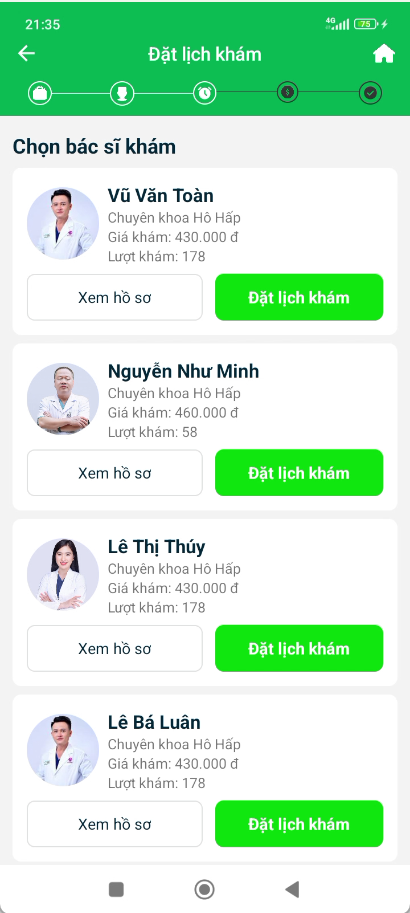

# Dự án Android "Ứng dụng Khám Chữa Bệnh Trực Tuyến"

## Bệnh nhân:
- Đăng nhập bằng email, tài khoản Google.
- Đặt lịch khám trực tuyến.
- Thanh toán phí khám trực tuyến.
- Khám trực tuyến qua video call với bác sĩ.
- Tạo lịch nhắc nhở uống thuốc cho đơn thuốc.

## Bác sĩ:
- Khám trực tuyến qua video call với bệnh nhân.
- Tạo kết quả khám, kê đơn thuốc cho bệnh nhân.

# Hình ảnh kết quả dự án:

  <!-- Khối 1 -->
  

    

      Giao diện 1
    

    
  

  <!-- Khối 2 -->
  

    

      Giao diện 2
    

    
  

