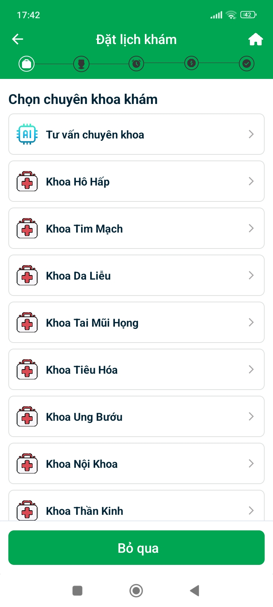
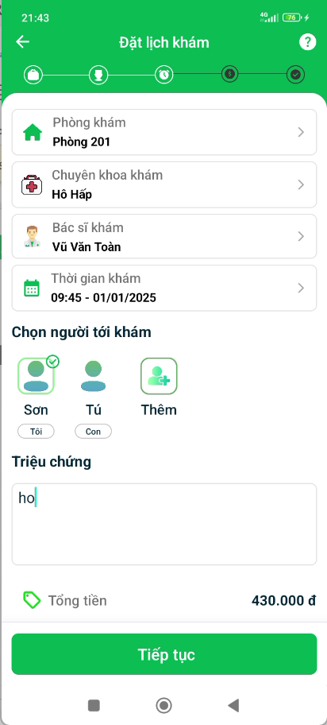
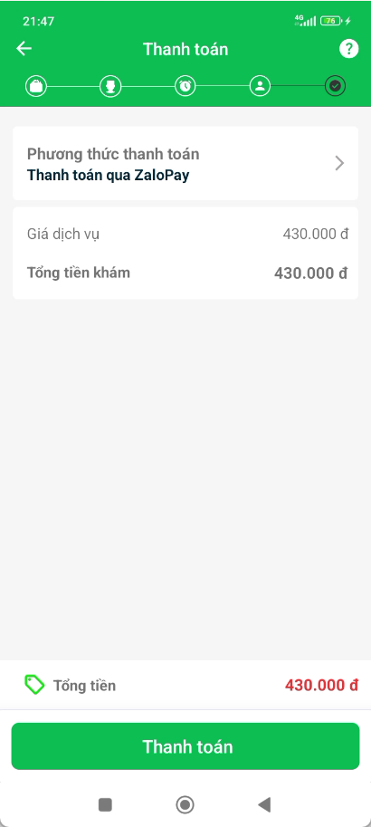
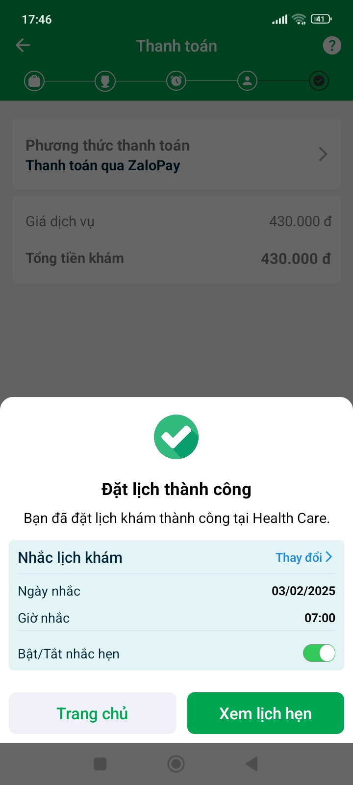
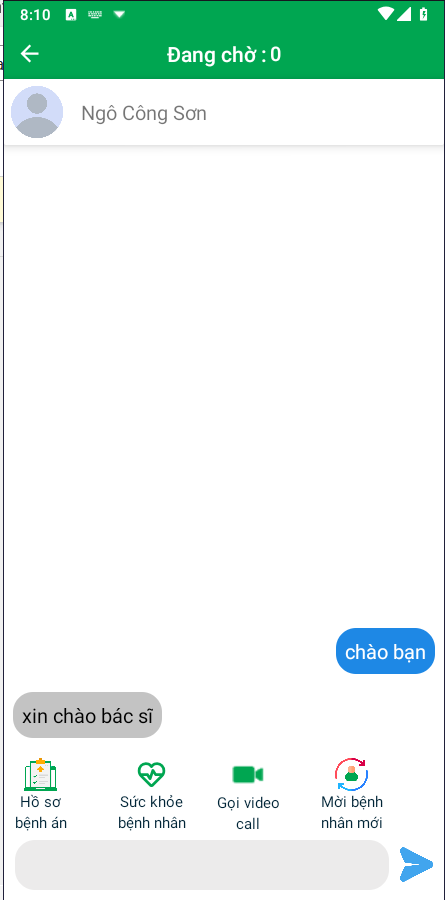
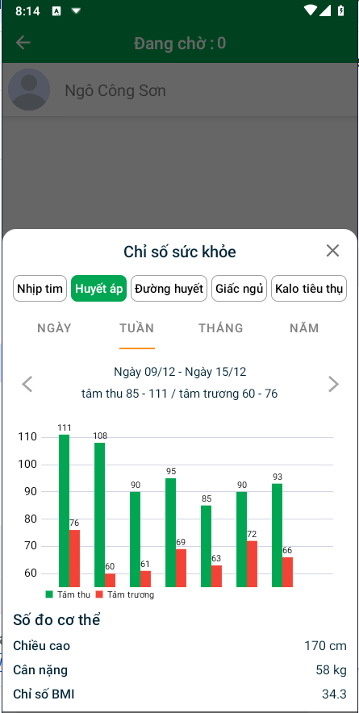

# Dự án Android "Ứng dụng Khám Chữa Bệnh Trực Tuyến"

## Bệnh nhân:
- Đăng nhập bằng email, tài khoản Google.
- Đặt lịch khám trực tuyến.
- Thanh toán phí khám trực tuyến.
- Khám trực tuyến qua video call với bác sĩ.
- Tạo lịch nhắc nhở uống thuốc cho đơn thuốc.

## Bác sĩ:
- Khám trực tuyến qua video call với bệnh nhân.
- Tạo kết quả khám, kê đơn thuốc cho bệnh nhân.
## Demo:
<iframe width="560" height="315" src="https://www.youtube.com/watch?v=Yd8Tp9csjYw&t=54s" frameborder="0" allow="accelerometer; autoplay; clipboard-write; encrypted-media; gyroscope; picture-in-picture" allowfullscreen></iframe>

# Hình ảnh kết quả dự án:
- ## Giao diện chính 
  
- ## Chức năng đặt lịch khám
 <table>
  <tr>
    <td style="padding: 10px; vertical-align: top; width: 30%;">
      

        

          Chọn chuyên khoa
        

        
      

    </td>
    <td style="padding: 10px; vertical-align: top; width: 30%;">
      

        

          Chọn bác sĩ
        

        
      

    </td>
    <td style="padding: 10px; vertical-align: top; width: 30%;">
      

        

          Chọn giờ khám
        

        
      

    </td>
    <td style="padding: 10px; vertical-align: top; width: 30%;">
      

        

          Nhập triệu chứng
        

        
      

    </td>
  </tr>
  <tr>
    <td style="padding: 10px; vertical-align: top; width: 30%;">
      

        

          Chọn phương thức thanh toán
        

        
      

    </td>
    <td style="padding: 10px; vertical-align: top; width: 30%;">
      

        

          Thanh toán zalopay
        

        
      

    </td>
    <td style="padding: 10px; vertical-align: top; width: 30%;">
      

        

          Xác nhận thành công
        

        
      

    </td>
  </tr>
 </table>
 
- ## Chức năng khám bệnh trực tuyến
 <table>
  <tr>
    <td style="padding: 10px; vertical-align: top; width: 30%;">
      

        

          Phòng chat
        

        
      

    </td>
    <td style="padding: 10px; vertical-align: top; width: 30%;">
      

        

          Xem chỉ số sức khỏe
        

        
      

    </td>
    <td style="padding: 10px; vertical-align: top; width: 30%;">
      

        

          Gọi video call
        

        
      

    </td>
  </tr>
 </table>

 - ## Chức năng nhắc nhở lịch uống thuốc
 <table>
  <tr>
    <td style="padding: 10px; vertical-align: top; width: 30%;">
      

        

          Danh sách lịch nhắc nhở
        

        
      

    </td>
    <td style="padding: 10px; vertical-align: top; width: 30%;">
      

        

          Tạo mới lịch nhắc
        

        
      

    </td>
    <td style="padding: 10px; vertical-align: top; width: 30%;">
      

        

          Tùy chỉnh lịch nhắc
        

        
      

    </td>
  </tr>
 </table>

